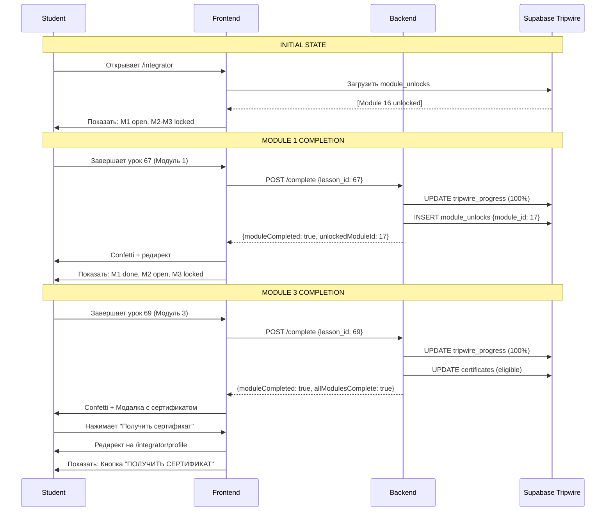

# План: Full Production Deploy Tripwire

## Текущее состояние системы

### Архитектура разблокировки модулей

- **Модуль 1** (ID: 16, Урок 67): Открыт для всех по умолчанию
- **Модуль 2** (ID: 17, Урок 68): Разблокируется после завершения модуля 1
- **Модуль 3** (ID: 18, Урок 69): Разблокируется после завершения модуля 2
- **Live Stream**: Открывается после завершения всех 3 модулей

### Логика работы (уже реализована)

В [`src/pages/tripwire/TripwireProductPage.tsx`](src/pages/tripwire/TripwireProductPage.tsx):

- Проверка `userUnlockedModuleIds` из таблицы `module_unlocks`
- Админы видят все модули открытыми (`isAdmin` bypass)
- Студенты видят только разблокированные модули

### База данных

**Tripwire Supabase**: `pjmvxecykysfrzppdcto`

Основные таблицы:

- `tripwire_users` - профили студентов
- `tripwire_progress` - прогресс по урокам
- `module_unlocks` - разблокированные модули
- `user_achievements` - достижения
- `certificates` - сертификаты

---

## Задачи для выполнения

### 1. Инициализация прогресса для всех студентов

**Проблема**: Новые студенты не имеют записей в `tripwire_progress` и `module_unlocks`.

**Решение**: Создать backend скрипт для инициализации.

#### 1.1 Создать скрипт `backend/scripts/init-all-students-progress.ts`

```typescript
/**
 * Инициализирует прогресс для ВСЕХ tripwire студентов
 * - Создает записи в tripwire_progress для урока 67
 * - Разблокирует модуль 1 (ID: 16) для всех
 * - Исключает админов и sales менеджеров
 */

import { createClient } from '@supabase/supabase-js';
import dotenv from 'dotenv';

dotenv.config({ path: './env.env' });

const TRIPWIRE_SUPABASE_URL = 'https://pjmvxecykysfrzppdcto.supabase.co';
const TRIPWIRE_SERVICE_KEY = process.env.TRIPWIRE_SERVICE_KEY!;

// Исключаем этих пользователей (admin + 2 sales managers)
const EXCLUDED_EMAILS = [
  'saint@onaiacademy.kz',  // Admin
  // Добавить email sales менеджеров
];

async function initAllStudents() {
  const supabase = createClient(TRIPWIRE_SUPABASE_URL, TRIPWIRE_SERVICE_KEY);
  
  // 1. Получить всех tripwire студентов (кроме исключенных)
  const { data: students, error } = await supabase
    .from('tripwire_users')
    .select('id, user_id, email, full_name')
    .not('email', 'in', `(${EXCLUDED_EMAILS.map(e => `"${e}"`).join(',')})`);
  
  if (error) throw error;
  
  console.log(`Found ${students.length} students to initialize`);
  
  for (const student of students) {
    console.log(`\nProcessing: ${student.full_name} (${student.email})`);
    
    // 2. Проверить есть ли уже прогресс по уроку 67
    const { data: existing } = await supabase
      .from('tripwire_progress')
      .select('*')
      .eq('tripwire_user_id', student.id)
      .eq('lesson_id', 67)
      .single();
    
    if (!existing) {
      // Создать запись прогресса для урока 67 (0%)
      await supabase
        .from('tripwire_progress')
        .insert({
          tripwire_user_id: student.id,
          lesson_id: 67,
          progress_percentage: 0,
          is_completed: false,
          last_position_seconds: 0
        });
      console.log('  ✅ Created progress for lesson 67');
    } else {
      console.log('  ⏭️  Progress already exists');
    }
    
    // 3. Проверить разблокирован ли модуль 1 (ID: 16)
    const { data: unlock } = await supabase
      .from('module_unlocks')
      .select('*')
      .eq('tripwire_user_id', student.id)
      .eq('module_id', 16)
      .single();
    
    if (!unlock) {
      // Разблокировать модуль 1
      await supabase
        .from('module_unlocks')
        .insert({
          tripwire_user_id: student.id,
          module_id: 16,
          unlocked_at: new Date().toISOString()
        });
      console.log('  ✅ Unlocked Module 1 (ID: 16)');
    } else {
      console.log('  ⏭️  Module 1 already unlocked');
    }
  }
  
  console.log(`\n✅ Initialized ${students.length} students!`);
}

initAllStudents().catch(console.error);
```

**Запустить:**

```bash
cd backend
npx tsx scripts/init-all-students-progress.ts
```

---

### 2. Добавить сообщение после завершения модуля 3

**Требование**: После завершения урока 69 (модуль 3) показать:

> "Вам открыт доступ к сертификату, завершающему эфиру. Теперь вы можете получить сертификат в разделе Мой профиль!"

С кнопкой "Получить сертификат" → редирект в `/integrator/profile`.

#### 2.1 Модифицировать [`src/pages/tripwire/TripwireLesson.tsx`](src/pages/tripwire/TripwireLesson.tsx)

В функции `handleCompleteModule()` (строки ~570-650), после успешного завершения:

```typescript
// После confetti и перед редиректом
if (lessonId === '69') { // Модуль 3 завершен
  // Показать специальный Toast с кнопкой
  toast({
    title: '🎉 Поздравляем! Все модули завершены!',
    description: (
      <div className="space-y-3">
        <p className="text-sm">
          Вам открыт доступ к <strong>сертификату</strong> и <strong>завершающему эфиру</strong>.
        </p>
        <p className="text-xs text-gray-400">
          Теперь вы можете получить сертификат в разделе <strong>Мой профиль</strong>!
        </p>
        <button
          onClick={() => navigate('/integrator/profile')}
          className="w-full mt-2 px-4 py-2 bg-[#00FF88] text-black font-bold rounded-lg hover:bg-[#00CC6A] transition-all"
        >
          ПОЛУЧИТЬ СЕРТИФИКАТ
        </button>
      </div>
    ),
    duration: 10000, // 10 секунд
  });
}
```

**Альтернатива**: Вместо Toast использовать кастомную модалку (более заметно).

#### 2.2 Создать модальное окно `src/components/tripwire/Module3CompleteModal.tsx`

```typescript
import { Dialog, DialogContent } from '@/components/ui/dialog';
import { motion } from 'framer-motion';
import { CheckCircle, Award, Radio } from 'lucide-react';
import { useNavigate } from 'react-router-dom';

interface Module3CompleteModalProps {
  open: boolean;
  onOpenChange: (open: boolean) => void;
}

export function Module3CompleteModal({ open, onOpenChange }: Module3CompleteModalProps) {
  const navigate = useNavigate();

  return (
    <Dialog open={open} onOpenChange={onOpenChange}>
      <DialogContent className="max-w-2xl bg-[#0A0A0A] border border-[#00FF88]/30">
        <div className="text-center space-y-6 p-6">
          {/* Animated Icon */}
          <motion.div
            initial={{ scale: 0 }}
            animate={{ scale: 1 }}
            transition={{ type: 'spring', duration: 0.6 }}
            className="flex justify-center"
          >
            <div className="w-24 h-24 bg-[#00FF88]/10 rounded-full flex items-center justify-center">
              <CheckCircle className="w-12 h-12 text-[#00FF88]" />
            </div>
          </motion.div>

          {/* Title */}
          <div>
            <h2 className="text-3xl font-bold text-white font-['JetBrains_Mono'] uppercase mb-2">
              🎉 Поздравляем!
            </h2>
            <p className="text-xl text-[#00FF88] font-['JetBrains_Mono']">
              Все модули завершены!
            </p>
          </div>

          {/* Content */}
          <div className="space-y-4 text-left bg-[#0F0F0F] border border-white/10 rounded-xl p-6">
            <div className="flex items-start gap-3">
              <Award className="w-6 h-6 text-[#00FF88] flex-shrink-0 mt-1" />
              <div>
                <h3 className="text-white font-bold mb-1">Доступ к сертификату</h3>
                <p className="text-gray-400 text-sm">
                  Теперь вы можете получить официальный сертификат о прохождении курса
                </p>
              </div>
            </div>
            
            <div className="flex items-start gap-3">
              <Radio className="w-6 h-6 text-[#FF3366] flex-shrink-0 mt-1" />
              <div>
                <h3 className="text-white font-bold mb-1">Завершающий эфир</h3>
                <p className="text-gray-400 text-sm">
                  Присоединяйтесь к финальному live-stream с разбором вопросов
                </p>
              </div>
            </div>
          </div>

          {/* Action Button */}
          <button
            onClick={() => {
              onOpenChange(false);
              navigate('/integrator/profile');
            }}
            className="w-full h-14 bg-[#00FF88] text-black font-bold font-['JetBrains_Mono'] uppercase tracking-wider rounded-xl hover:bg-[#00CC6A] transition-all shadow-[0_0_30px_rgba(0,255,136,0.3)]"
          >
            ПОЛУЧИТЬ СЕРТИФИКАТ
          </button>

          <p className="text-xs text-gray-500">
            Вы можете найти сертификат в разделе <strong>Мой профиль</strong>
          </p>
        </div>
      </DialogContent>
    </Dialog>
  );
}
```

**Интегрировать в `TripwireLesson.tsx`:**

```typescript
import { Module3CompleteModal } from '@/components/tripwire/Module3CompleteModal';

// В компоненте:
const [showModule3Modal, setShowModule3Modal] = useState(false);

// В handleCompleteModule() после confetti:
if (lessonId === '69') {
  setTimeout(() => {
    setShowModule3Modal(true);
  }, 2000);
}

// В JSX:
<Module3CompleteModal 
  open={showModule3Modal} 
  onOpenChange={setShowModule3Modal} 
/>
```

---

### 3. Проверка и исключение админов/менеджеров

**Уточнить у пользователя**:

1. Email админа: `saint@onaiacademy.kz` (уже известен)
2. Email 2-х sales менеджеров: **НУЖНО УТОЧНИТЬ**

**Запрос к БД для проверки:**

```sql
SELECT email, full_name, role 
FROM tripwire_users 
WHERE email IN ('saint@onaiacademy.kz', 'manager1@example.com', 'manager2@example.com');
```

---

### 4. Production Deploy

#### 4.0 КРИТИЧНО: Проверка URL перед деплоем

**ОБЯЗАТЕЛЬНО ПРОВЕРИТЬ И ЗАМЕНИТЬ ВСЕ ЛОКАЛЬНЫЕ URL НА ПРОДАКШН!**

Частые ошибки при деплое:

1. **API Endpoints:**

                                                - ❌ BAD: `http://localhost:3000/api/...`
                                                - ❌ BAD: `http://localhost:8080/api/...`
                                                - ✅ GOOD: `https://api.onai.academy/api/...`
                                                - ✅ GOOD: Использовать `import.meta.env.VITE_API_URL`

2. **Frontend URLs:**

                                                - ❌ BAD: `http://localhost:8080/integrator/...`
                                                - ❌ BAD: Hardcoded `localhost` в любом виде
                                                - ✅ GOOD: `https://onai.academy/integrator/...`
                                                - ✅ GOOD: Использовать относительные пути `/integrator/...`

3. **Media URLs (images, videos, GIFs):**

                                                - ❌ BAD: Локальные пути или временные URL
                                                - ✅ GOOD: CDN или Supabase Storage URLs

4. **WebSocket/SSE URLs:**

                                                - ❌ BAD: `ws://localhost:3000`
                                                - ✅ GOOD: `wss://api.onai.academy`

**Команды для проверки:**

```bash
# Проверить все файлы на localhost упоминания
cd /Users/miso/onai-integrator-login
grep -r "localhost" src/ --include="*.tsx" --include="*.ts" | grep -v "node_modules"

# Проверить hardcoded API URLs
grep -r "http://localhost:3000" src/ --include="*.tsx" --include="*.ts"
grep -r "http://localhost:8080" src/ --include="*.tsx" --include="*.ts"

# Проверить backend тоже
grep -r "localhost" backend/src/ --include="*.ts" | grep -v "node_modules"
```

**Исключения (допустимы localhost):**

- Комментарии в коде
- Development-only конфиги (`.env.local`, `.env.development`)
- README.md и документация

---

#### 4.1 Frontend Build

```bash
cd /Users/miso/onai-integrator-login
npm run build
```

**Проверить:**

- Размер bundle
- Нет ошибок build
- Все environment variables корректны
- ✅ **НЕТ localhost упоминаний в production коде**

#### 4.2 Backend Deployment

**Подключиться к серверу:**

```bash
ssh root@your-server-ip
cd /var/www/onai-integrator-login
```

**Обновить код:**

```bash
git pull origin main
```

**Обновить backend:**

```bash
cd backend
npm install
pm2 restart onai-backend
pm2 logs onai-backend --lines 50
```

**Обновить frontend:**

```bash
cd ..
npm run build
sudo systemctl reload nginx
```

#### 4.3 Post-Deploy Checklist

**КРИТИЧНО - Проверить в browser console:**

```
1. Открыть DevTools (F12)
2. Перейти на вкладку Network
3. Проверить что ВСЕ API запросы идут на https://api.onai.academy
4. НЕ ДОЛЖНО БЫТЬ запросов на localhost!
```

**Функциональное тестирование:**

1. **Проверить сайт работает**: `https://onai.academy`
2. **Тест логина студента**:

                                                                                                                                                                                                - Зайти как тестовый студент
                                                                                                                                                                                                - Проверить модуль 1 открыт, модули 2-3 заблокированы

3. **Тест завершения модуля**:

                                                                                                                                                                                                - Досмотреть урок 67 до конца
                                                                                                                                                                                                - Нажать "Завершить модуль"
                                                                                                                                                                                                - Проверить модуль 2 разблокировался

4. **Тест завершения всех модулей**:

                                                                                                                                                                                                - Завершить урок 69
                                                                                                                                                                                                - Проверить появление модалки с сообщением о сертификате
                                                                                                                                                                                                - Проверить кнопка "Получить сертификат" работает

5. **Проверить админ-доступ**:

                                                                                                                                                                                                - Зайти как `saint@onaiacademy.kz`
                                                                                                                                                                                                - Проверить все модули открыты (god mode)

#### 4.4 Мониторинг после Deploy

```bash
# Backend logs
pm2 logs onai-backend --lines 100

# Nginx logs
sudo tail -f /var/log/nginx/access.log
sudo tail -f /var/log/nginx/error.log

# Check Supabase Tripwire DB
# Открыть Supabase Dashboard: pjmvxecykysfrzppdcto
# Проверить записи в tripwire_progress и module_unlocks растут
```

---

## Диаграмма: User Journey (Студент)



---

## Вопросы для уточнения

### КРИТИЧНО (нужно ответить перед выполнением):

1. **Email 2-х sales менеджеров**, которых нужно исключить из инициализации?

                                                                                                                                                                                                - Или можно проверить в БД: `SELECT email FROM tripwire_users WHERE role = 'sales_manager';`

2. **Способ уведомления после модуля 3**:

                                                                                                                                                                                                - Вариант A: Toast с кнопкой (быстро, менее заметно)
                                                                                                                                                                                                - Вариант B: Модальное окно (более заметно, рекомендуется)
                                                                                                                                                                                                - **Ваш выбор?**

3. **Deploy strategy**:

                                                                                                                                                                                                - Вариант A: Deploy сразу после изменений
                                                                                                                                                                                                - Вариант B: Сначала тест на локальной копии продакшена
                                                                                                                                                                                                - **Ваш выбор?**

---

## Итоговые файлы

### Новые файлы:

1. `backend/scripts/init-all-students-progress.ts` - скрипт инициализации
2. `src/components/tripwire/Module3CompleteModal.tsx` - модалка завершения

### Изменения:

1. [`src/pages/tripwire/TripwireLesson.tsx`](src/pages/tripwire/TripwireLesson.tsx) - добавить модалку после урока 69

### Без изменений (уже работает):

- [`src/pages/tripwire/TripwireProductPage.tsx`](src/pages/tripwire/TripwireProductPage.tsx) - логика разблокировки
- [`src/pages/tripwire/components/CertificateSection.tsx`](src/pages/tripwire/components/CertificateSection.tsx) - генерация сертификата
- [`backend/src/routes/tripwire-lessons.ts`](backend/src/routes/tripwire-lessons.ts) - backend логика

---

## Оценка времени

| Задача | Время |

|--------|-------|

| 1. Создать и запустить скрипт инициализации | 10 мин |

| 2. Добавить модалку после модуля 3 | 20 мин |

| 3. Тестирование на локали | 15 мин |

| 4. Deploy на продакшен | 15 мин |

| 5. Post-deploy проверка | 10 мин |

| **ИТОГО** | **~70 минут** |

---

**Готов к выполнению?** Жду ответы на вопросы, чтобы начать имплементацию! 🚀