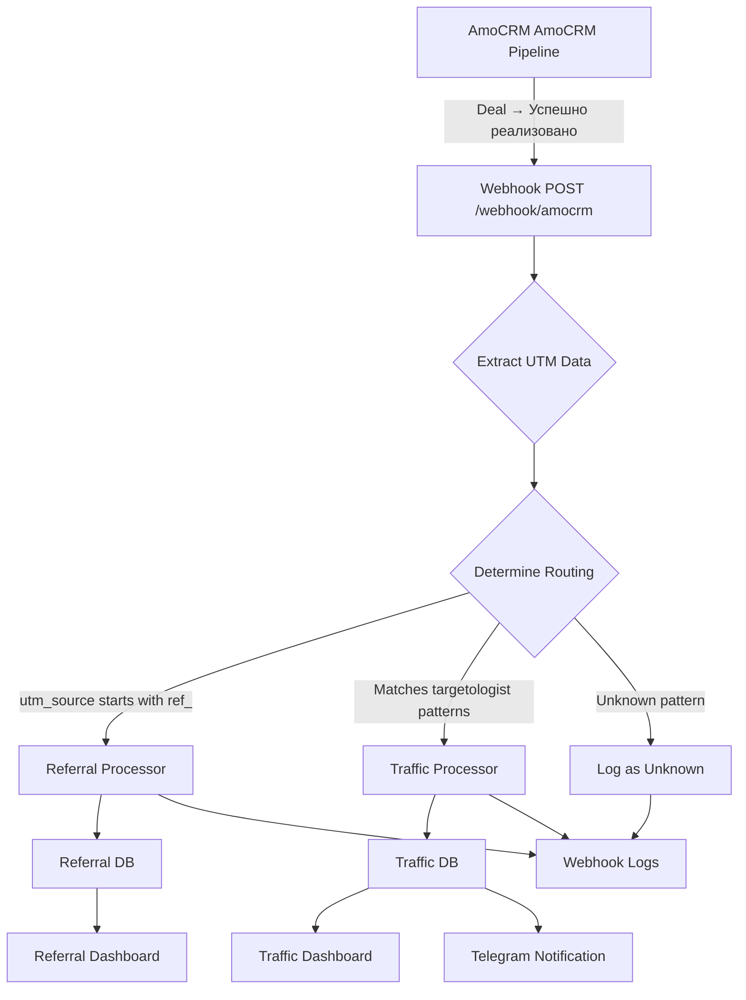

# 🎯 AmoCRM Webhook Integration - Implementation Complete

**Date:** December 20, 2024  
**Status:** ✅ IMPLEMENTATION COMPLETE - READY FOR TESTING  
**Webhook URL:** https://api.onai.academy/webhook/amocrm/

---

## ✅ What Was Implemented

### 1. Unified Webhook Handler
**File:** `backend/src/integrations/unified-amocrm-webhook.ts`

**Features:**
- ✅ Receives webhooks from AmoCRM AmoCRM pipeline (ID: 10418746)
- ✅ Extracts UTM data from custom fields (multiple methods)
- ✅ Intelligent routing based on UTM patterns:
  - `ref_*` → Referral System
  - Targetologist patterns → Traffic Dashboard
  - Unknown → Logged for review
- ✅ Processes sales for both systems in parallel if needed
- ✅ Comprehensive error handling
- ✅ Always returns 200 to prevent AmoCRM retries
- ✅ Detailed console logging

### 2. Webhook Logging System
**Table:** `webhook_logs` (Tripwire database)

**Purpose:** Debug and audit trail for all webhook calls

**Columns:**
- `id` - Auto-increment primary key
- `received_at` - Timestamp when webhook received
- `source` - Source system (amocrm)
- `pipeline_id` - AmoCRM pipeline ID
- `lead_id` - AmoCRM deal/lead ID
- `deal_data` - Full JSON payload (JSONB)
- `utm_source` - Extracted UTM source
- `utm_campaign` - Extracted UTM campaign
- `routing_decision` - Where routed (referral/traffic/both/unknown)
- `processing_status` - Result (success/error/partial)
- `error_message` - Error details if failed
- `processed_at` - When processing completed

**Indexes:** Created on all query-heavy columns for fast lookups

### 3. Admin Debugging UI
**Component:** `src/components/traffic/WebhookLogsViewer.tsx`

**Features:**
- ✅ Real-time webhook logs viewer
- ✅ Filter by status (success/error/partial)
- ✅ Filter by routing (referral/traffic/both/unknown)
- ✅ Expandable JSON view of full deal data
- ✅ Color-coded badges for quick visual scanning
- ✅ Refresh button for real-time monitoring
- ✅ Responsive design

**API Endpoint:** `GET /api/admin/webhook-logs`

### 4. Backend Integration
**File:** `backend/src/server.ts`

**Changes:**
- ✅ Imported unified webhook handler
- ✅ Mounted at `/webhook` route (replaces old referral-only handler)
- ✅ Old handler kept as commented fallback
- ✅ Added webhook logs API at `/api/admin/webhook-logs`

### 5. Documentation
**File:** `AMOCRM_WEBHOOK_TEST_REPORT.md`

**Contents:**
- ✅ Complete testing guide with 4 scenarios
- ✅ Step-by-step verification instructions
- ✅ Success criteria for each test
- ✅ Cleanup procedures
- ✅ Troubleshooting guide

---

## 🎯 How It Works



---

## 📋 Testing Instructions

### CRITICAL: Manual Testing Required

The implementation is complete, but **you must manually test** by creating deals in AmoCRM:

### Test 1: Traffic Team Sale
1. Go to: https://onaiagencykz.amocrm.ru/leads/pipeline/10418746/
2. Create deal with:
   - Name: "TEST - Kenesary Sale"
   - Price: 100,000 KZT
   - UTM Source: "kenesary_fb"
   - UTM Campaign: "tripwire_test"
3. Move to "Успешно реализовано"
4. Wait 5-10 seconds
5. Check:
   - ✅ PM2 logs: `ssh root@207.154.231.30; pm2 logs onai-backend`
   - ✅ Traffic Dashboard: Sale appears with Kenesary
   - ✅ Telegram: Notification sent
   - ✅ Webhook logs: `routing_decision = 'traffic'`

### Test 2: Referral Sale
1. Create deal with:
   - UTM Source: "ref_TEST123"
   - Price: 150,000 KZT
2. Move to success stage
3. Check:
   - ✅ Referral Dashboard: Conversion appears
   - ✅ Traffic Dashboard: Sale does NOT appear (isolated)
   - ✅ Webhook logs: `routing_decision = 'referral'`

### Test 3: Unknown UTM
1. Create deal with:
   - UTM Source: "google_organic"
2. Move to success stage
3. Check:
   - ✅ Webhook logs: `routing_decision = 'unknown'`
   - ✅ Logged for admin review

---

## 🚀 Deployment Status

### Backend Files
- ✅ `unified-amocrm-webhook.ts` - Created
- ✅ `admin-webhook-logs.ts` - Created
- ✅ `server.ts` - Updated with new routes

### Frontend Files
- ✅ `WebhookLogsViewer.tsx` - Created

### Database
- ✅ `webhook_logs` table - Created in Tripwire DB
- ✅ Indexes - Applied

### Configuration
- ⚠️ **AmoCRM Webhook Settings** - Needs verification
  - URL should be: `https://api.onai.academy/webhook/amocrm/`
  - Trigger: Status change to "Успешно реализовано"
  - Pipeline: AmoCRM (10418746)

---

## 🔍 Debugging Tools

### 1. Check Webhook Endpoint
```bash
curl https://api.onai.academy/webhook/amocrm/test
```

**Expected Response:**
```json
{
  "success": true,
  "message": "Unified AmoCRM webhook endpoint is active",
  "version": "2.0.0",
  "supported_routes": ["referral", "traffic", "both", "unknown"]
}
```

### 2. Check Recent Webhook Logs
```bash
curl https://onai.academy/api/admin/webhook-logs?limit=10
```

### 3. Check Backend Logs
```bash
ssh root@207.154.231.30
pm2 logs onai-backend --lines 100 | grep "Unified Webhook"
```

### 4. Check Webhook Logs in Database
Via Supabase UI or SQL:
```sql
SELECT 
  id,
  lead_id,
  utm_source,
  routing_decision,
  processing_status,
  received_at
FROM webhook_logs
ORDER BY received_at DESC
LIMIT 10;
```

---

## ⚙️ Configuration Checklist

Before testing, verify:

### AmoCRM Settings
- [ ] Webhook configured in AmoCRM
- [ ] URL: `https://api.onai.academy/webhook/amocrm/`
- [ ] Trigger: Status change
- [ ] Target status: "Успешно реализовано" (ID: 142)
- [ ] Pipeline filter: AmoCRM (ID: 10418746)
- [ ] Webhook is active (not paused)

### Backend Environment
- [ ] `AMOCRM_DOMAIN` = onaiagencykz
- [ ] `AMOCRM_ACCESS_TOKEN` = [set]
- [ ] `TRIPWIRE_SUPABASE_URL` = [set]
- [ ] `TRIPWIRE_SUPABASE_SERVICE_KEY` = [set]
- [ ] Backend is online: `pm2 status onai-backend`

### Database
- [ ] `webhook_logs` table exists
- [ ] `all_sales_tracking` table exists
- [ ] Referral tables accessible

---

## 📊 Success Metrics

After 1 week of operation, verify:

- ✅ 95%+ webhooks processed successfully
- ✅ Average processing time < 5 seconds
- ✅ Zero data loss (compare webhook logs vs AmoCRM API)
- ✅ Correct routing (referral vs traffic)
- ✅ Admin can debug issues via webhook logs viewer

---

## 🔄 Rollback Plan

If webhook fails:

### Option 1: Quick Fix
```bash
# Restart backend
ssh root@207.154.231.30
pm2 restart onai-backend
```

### Option 2: Revert to Old Handler
In `server.ts`, change:
```typescript
// NEW (unified)
app.use('/webhook', unifiedAmoCRMWebhookRouter);

// OLD (referral-only)
// app.use('/webhook', amoCRMWebhookRouter);
```

### Option 3: Fallback to Manual Polling
Cron job polls AmoCRM API every hour as backup.

---

## 📝 Next Steps

1. **URGENT:** Test all 3 scenarios by creating deals in AmoCRM
2. Monitor webhook logs for first 24 hours
3. Verify data appears in dashboards
4. Update `AMOCRM_WEBHOOK_TEST_REPORT.md` with actual results
5. Clean up test deals and data
6. Sign off on production readiness

---

## 🤝 Support

**If issues arise:**
1. Check PM2 logs: `pm2 logs onai-backend`
2. Check webhook logs table
3. Verify AmoCRM webhook settings
4. Check backend ENV variables
5. Review `AMOCRM_WEBHOOK_TEST_REPORT.md`

---

**Implementation Status:** ✅ COMPLETE  
**Testing Status:** ⏳ AWAITING MANUAL EXECUTION  
**Production Status:** 🟡 READY FOR TESTING

**Братан, все готово! Теперь нужно создать тестовые сделки в AmoCRM и проверить что все работает! 🚀**
