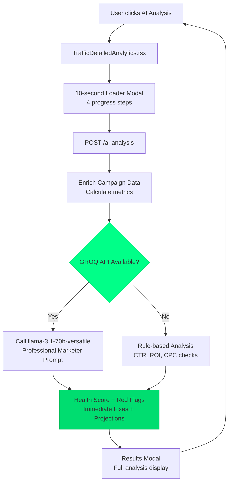
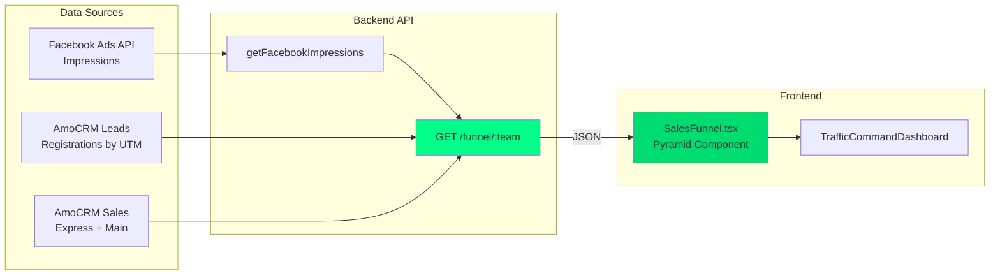
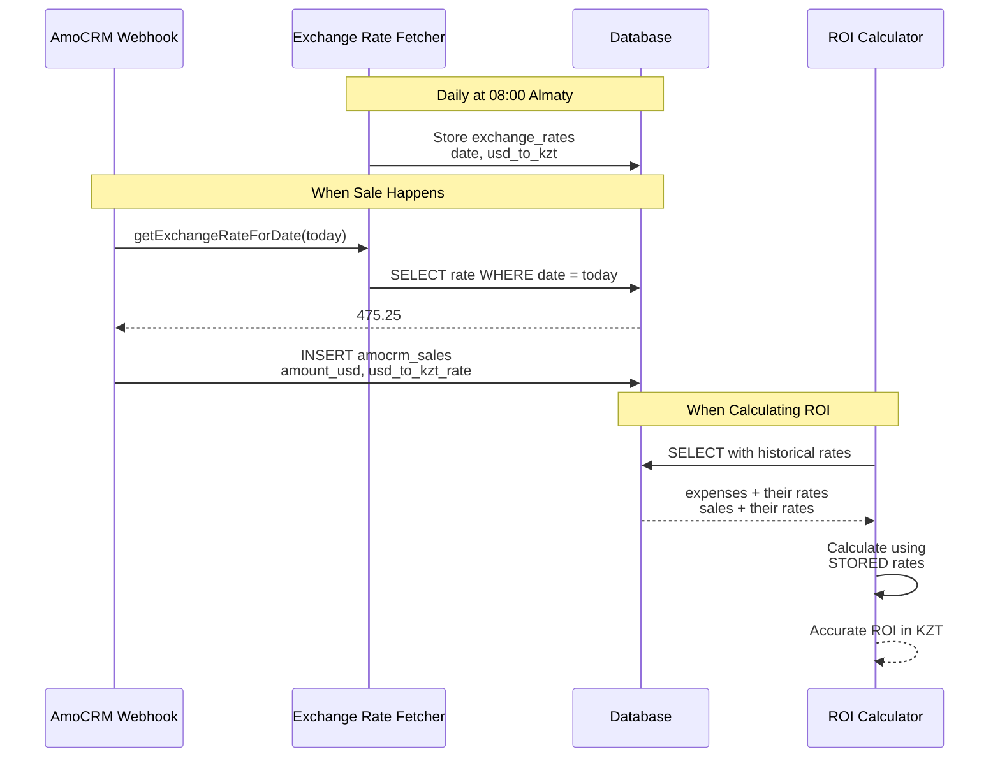
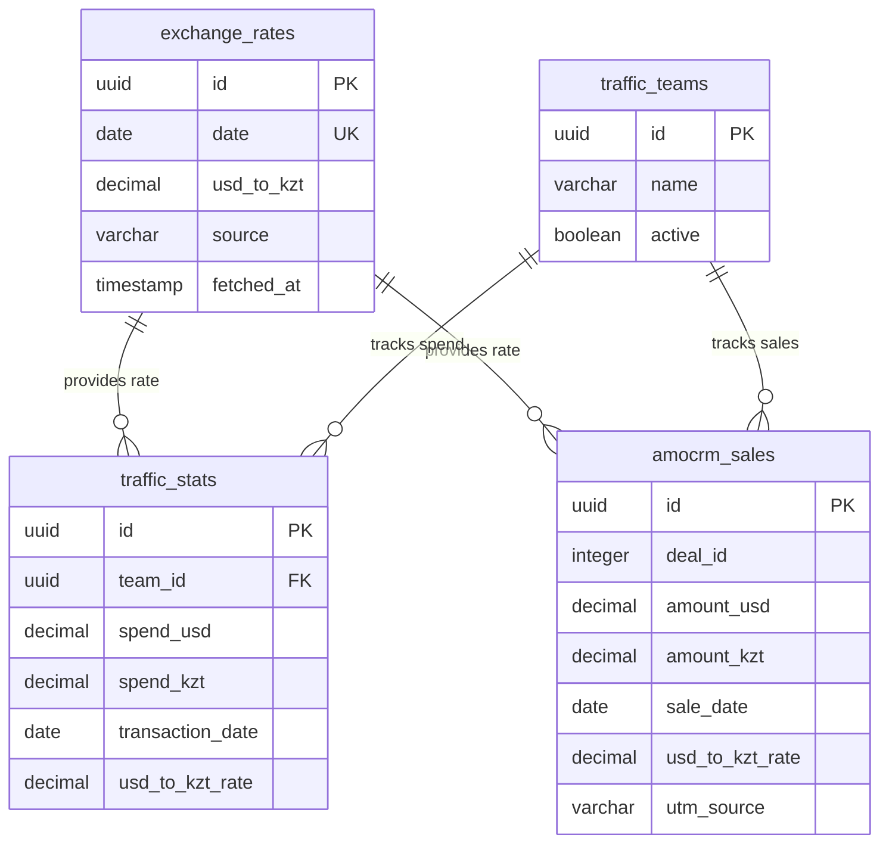

# System Architecture Diagram

## Currency & Reports System Flow

```mermaid
sequenceDiagram
    participant Cron as Cron Jobs
    participant ExchangeAPI as Exchange Rate API
    participant DB as Supabase DB
    participant ROI as ROI Calculator
    participant TG as Telegram Bot
    
    Note over Cron,TG: Daily Cycle (Almaty UTC+6)
    
    rect rgb(0, 50, 0)
        Note right of Cron: 08:00 Almaty (02:00 UTC)
        Cron->>ExchangeAPI: Fetch USD/KZT rate
        ExchangeAPI-->>Cron: 475.25 KZT
        Cron->>ExchangeAPI: Try backup API (if failed)
        Cron->>DB: Store rate + date
        Cron->>TG: "Курс обновлен: 475.25"
    end
    
    rect rgb(0, 0, 50)
        Note right of Cron: 08:05 Almaty (02:05 UTC)
        Cron->>DB: Get today's rate
        DB-->>Cron: 475.25 KZT
        Cron->>DB: Get teams
        loop Each Team
            Cron->>ROI: calculateROI(team, yesterday)
            ROI->>DB: Get expenses with historical rates
            ROI->>DB: Get sales with historical rates
            ROI-->>Cron: profit_kzt, roi_percent
        end
        Cron->>TG: Daily Report (KZT format)
    end
    
    rect rgb(50, 0, 50)
        Note right of Cron: Monday 08:10 Almaty
        Cron->>ROI: calculateROI(all teams, last week)
        ROI-->>Cron: Weekly stats + trends
        Cron->>Cron: generateRecommendations()
        Cron->>TG: Weekly Report + Recommendations
    end
```

## AI Analysis Flow

## Sales Funnel Data Flow

## Transaction Flow with Exchange Rate

## Component Hierarchy

```mermaid
graph TD
    Dashboard[TrafficCommandDashboard.tsx]
    Dashboard --> OnBoarding[OnboardingTour<br/>React Joyride]
    Dashboard --> CurrencyToggle[USD/KZT Toggle<br/>Already implemented]
    Dashboard --> KPICards[KPI Metrics Cards]
    Dashboard --> Funnel[SalesFunnel Component<br/>NEW - Pyramid]
    Dashboard --> TeamCards[Team Performance Cards]
    Dashboard --> UTMTop[Top UTM Metrics]
    
    Funnel --> Stage1[IMPRESSIONS 100%]
    Funnel --> Stage2[REGISTRATIONS 85%]
    Funnel --> Stage3[EXPRESS SALES 60%]
    Funnel --> Stage4[MAIN SALES 35%]
    
    style Dashboard fill:#000,stroke:#00FF88
    style Funnel fill:#00FF88,stroke:#00DD70
    style OnBoarding fill:#00DD70,stroke:#00BB58
```

## Cron Jobs Schedule

```mermaid
gantt
    title Cron Jobs Timeline (Almaty UTC+6)
    dateFormat HH:mm
    axisFormat %H:%M
    
    section Daily
    Exchange Rate Fetch    :08:00, 1m
    Daily Traffic Report   :08:05, 1m
    
    section Weekly
    Weekly Report (Mon)    :08:10, 1m
```

## Database Schema

---

## API Endpoints

### New Endpoints:
1. `POST /api/traffic-detailed-analytics/ai-analysis` - GROQ campaign analysis
2. `GET /api/traffic-stats/funnel/:teamId` - Sales funnel data
3. `GET /webhook/amocrm/traffic/test` - Webhook status check

### Updated Endpoints:
- `/webhook/amocrm/traffic` - Now stores exchange rate with each sale

---

## Technology Stack

### Backend:
- **Cron Jobs:** `node-cron`
- **Exchange Rate APIs:** exchangerate-api.com, currencyapi.com
- **AI Model:** GROQ `llama-3.1-70b-versatile`
- **Database:** Supabase PostgreSQL
- **Messaging:** Telegram Bot API

### Frontend:
- **Charts:** `framer-motion` for animations
- **UI:** Tailwind CSS with custom gradients
- **State:** React hooks (useState, useEffect)
- **HTTP:** Axios

---

## Key Metrics

### Exchange Rate System:
- Updates: Daily at 08:00 Almaty
- Fallback: 2 backup APIs + yesterday's rate
- Storage: Historical rates with each transaction

### AI Analysis:
- Model: llama-3.1-70b-versatile (8K context)
- Temperature: 0.3 (analytical)
- Fallback: Rule-based if GROQ fails
- Response time: ~10 seconds

### Sales Funnel:
- 4 stages with conversion rates
- Data sources: Facebook API + AmoCRM
- Refresh: On date range change
- Empty state: "Нет данных"

---

**Architecture Status:** PRODUCTION READY ✅
