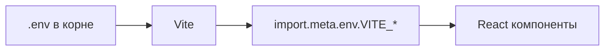
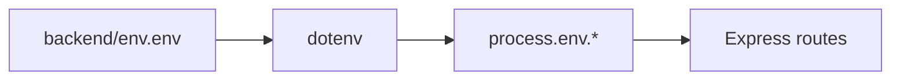

# 🗂️ ENV FILES STRUCTURE - Визуальная схема

## 📂 Структура файлов

```
C:\onai-integrator-login\onai-integrator-login\
│
├── 📄 .env                          ← FRONTEND ENV (VITE_*)
│   └── Содержит:
│       ├── VITE_SUPABASE_URL
│       ├── VITE_SUPABASE_ANON_KEY
│       ├── VITE_TRIPWIRE_SUPABASE_URL
│       ├── VITE_TRIPWIRE_SUPABASE_ANON_KEY
│       ├── VITE_API_URL
│       └── VITE_BUNNY_*
│
├── 📁 src/
│   └── main.tsx → читает .env через import.meta.env.VITE_*
│
└── 📁 backend/
    │
    ├── 📄 env.env                   ← BACKEND ENV (ВСЕ КЛЮЧИ!)
    │   └── Содержит:
    │       ├── SUPABASE_URL
    │       ├── SUPABASE_SERVICE_ROLE_KEY  (ПРИВАТНЫЙ!)
    │       ├── TRIPWIRE_SUPABASE_URL
    │       ├── TRIPWIRE_SERVICE_ROLE_KEY  (ПРИВАТНЫЙ!)
    │       ├── OPENAI_API_KEY
    │       ├── TELEGRAM_BOT_TOKEN_*
    │       ├── AMOCRM_*
    │       ├── BUNNY_STREAM_API_KEY       (ПРИВАТНЫЙ!)
    │       ├── SMTP_*
    │       └── и другие приватные ключи
    │
    └── 📁 src/
        └── server.ts → читает env.env через dotenv.config()
```

---

## 🔄 Как это работает

### 1️⃣ **Frontend (Vite)**



**Код:**
```typescript
// src/lib/supabase.ts
const supabaseUrl = import.meta.env.VITE_SUPABASE_URL;
const supabaseKey = import.meta.env.VITE_SUPABASE_ANON_KEY;
```

**Перезапуск после изменений:**
```bash
npm run dev  # Перезапусти frontend
```

---

### 2️⃣ **Backend (Express.js)**



**Код:**
```typescript
// backend/src/server.ts (строка 10)
dotenv.config({ path: path.join(__dirname, '..', 'env.env') });

// Использование
const openaiKey = process.env.OPENAI_API_KEY;
const supabaseServiceKey = process.env.SUPABASE_SERVICE_ROLE_KEY;
```

**Перезапуск после изменений:**
```bash
cd backend
npm run dev  # Перезапусти backend
```

---

## 🚨 Частые ошибки

### ❌ **Ошибка 1: Создали `backend/.env`**

```
backend/
├── env.env     ← Правильный
└── .env        ← УДАЛИ! Вызывает конфликт!
```

**Почему:** dotenv по умолчанию ищет `.env`, если его найдет - не прочитает `env.env`

**Решение:**
```powershell
Remove-Item backend\.env -Force
```

---

### ❌ **Ошибка 2: Положили SERVICE_ROLE_KEY в frontend .env**

```bash
# ❌ НЕПРАВИЛЬНО в .env (корень)
VITE_SUPABASE_SERVICE_ROLE_KEY=eyJhbGc...  # ОПАСНО!
```

**Почему:** Frontend код виден в браузере → ключ украдут → полный доступ к базе

**Решение:** SERVICE_ROLE_KEY ТОЛЬКО в `backend/env.env`!

---

### ❌ **Ошибка 3: Забыли префикс VITE_**

```bash
# ❌ НЕПРАВИЛЬНО в .env (корень)
SUPABASE_URL=https://...  # Vite не увидит!

# ✅ ПРАВИЛЬНО
VITE_SUPABASE_URL=https://...  # Vite увидит
```

---

## 🎯 Быстрая проверка

### PowerShell команды:

```powershell
# Проверка структуры
Test-Path ".env"                      # ✅ True
Test-Path "backend\env.env"           # ✅ True
Test-Path "backend\.env"              # ✅ False (должен быть False!)

# Проверка содержимого Backend env
Get-Content "backend\env.env" | Select-String "OPENAI_API_KEY"

# Проверка содержимого Frontend env  
Get-Content ".env" | Select-String "VITE_"
```

### Проверка в runtime:

**Backend:**
```bash
cd backend
npm run dev

# Должно показать:
# 🔑 OPENAI_API_KEY: Exists: true
# 🔑 SUPABASE_SERVICE_ROLE_KEY: Exists: true
```

**Frontend:**
```bash
npm run dev

# В browser console должно быть:
# [DEV] ✅ Supabase config ready
# [DEV] ✅ Tripwire Supabase config ready
```

---

## 📝 Checklist перед коммитом

- [ ] `.env` в `.gitignore`
- [ ] `backend/env.env` в `.gitignore`
- [ ] `backend/.env` НЕ существует
- [ ] Все VITE_* переменные в `.env` (корень)
- [ ] Все приватные ключи в `backend/env.env`
- [ ] Backend запускается без ошибок
- [ ] Frontend запускается без ошибок
- [ ] НЕТ SERVICE_ROLE_KEY в `.env` (корень)

---

## 📚 Дополнительные ресурсы

- [ENV_USAGE_GUIDE.md](./ENV_USAGE_GUIDE.md) - Полный гайд
- [backend/SETUP.md](./backend/SETUP.md) - Backend setup
- [Vite Env Variables](https://vitejs.dev/guide/env-and-mode.html)
- [dotenv Documentation](https://github.com/motdotla/dotenv)

---

**Создано:** 12.12.2025  
**Автор:** Claude AI  
**Статус:** ✅ Протестировано на Windows 10


