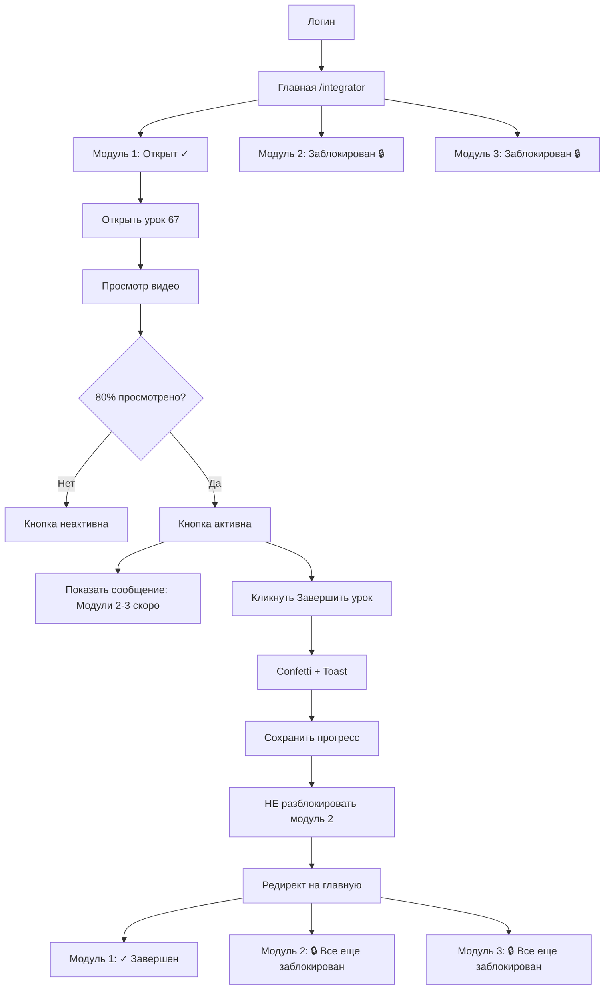
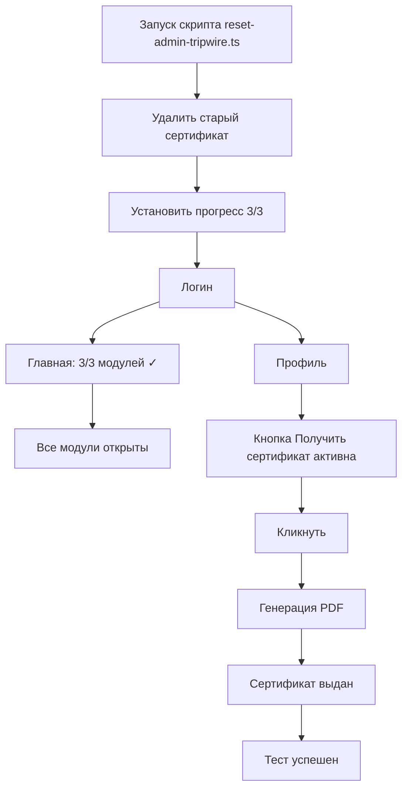

# ✅ Tripwire Launch Ready - Implementation Complete

## 🎯 Цель
Временно отключить автоматическую разблокировку модулей 2 и 3 до момента загрузки контента, при этом сохранив отслеживание прогресса и функционал завершения уроков.

---

## ✅ Выполненные изменения

### 1. Backend: Отключение авто-разблокировки
**Файл:** `backend/src/routes/tripwire-lessons.ts`

**Что изменено:**
- Добавлен флаг `AUTO_UNLOCK_ENABLED = false` (строка 268)
- Логика разблокировки следующего модуля обернута в условие
- Achievement продолжает создаваться независимо от разблокировки

**Результат:**
- ✅ Прогресс урока фиксируется
- ✅ Урок помечается как завершенный
- ✅ Achievement создается
- ❌ Следующий модуль НЕ разблокируется автоматически

**Лог при завершении урока:**
```
[STEP 6] ✅ Module 16 COMPLETED! (Auto-unlock check...)
⏸️ [STEP 6a SKIPPED] Auto-unlock disabled (waiting for module 2-3 content)
✅ [STEP 6b SUCCESS] Achievement created: first_module_complete
```

### 2. Frontend: Информационное сообщение
**Файл:** `src/pages/tripwire/TripwireLesson.tsx`

**Что добавлено:**
- Информационное сообщение для студентов (строки ~876-883)
- Показывается когда урок готов к завершению (80% просмотрено)
- Только для модуля 1 (16)

**Текст сообщения:**
```
📚 Модули 2 и 3 появятся скоро! Следите за объявлениями.
```

**Дизайн:**
- Плавная анимация появления (fade-in + slide down)
- Cyber-стиль (серый текст, Manrope шрифт)
- Адаптивная верстка

### 3. Скрипт для админ-аккаунта
**Файл:** `backend/scripts/reset-admin-tripwire.ts`

**Функционал:**
1. Находит пользователя по email: `smmmcwin@gmail.com`
2. Удаляет существующий сертификат из БД
3. Удаляет файл сертификата из Supabase Storage
4. Устанавливает прогресс: все 3 модуля завершены
5. Обновляет профиль: `certificate_issued = false`

**Запуск:**
```bash
cd backend
npx tsx scripts/reset-admin-tripwire.ts
```

**Результат:**
- Админ может заново сгенерировать сертификат
- Прогресс: 3/3 модулей
- Все модули разблокированы
- Можно тестировать генерацию сертификата

### 4. Документация
**Созданы файлы:**
1. `TRIPWIRE_TESTING_INSTRUCTIONS.md` - Детальные инструкции для тестирования
2. `TRIPWIRE_DEPLOYMENT_GUIDE.md` - Руководство по деплою
3. `TRIPWIRE_LAUNCH_READY.md` - Этот файл (summary)

---

## 🔒 Безопасность

### Что НЕ затронуто
✅ Публичные лендинги (`TripwireLanding.tsx` - маркетинговая страница)
✅ Выгрузка лидов в AmoCRM
✅ Админ панель для публичных сайтов
✅ Другие курсы и модули (только 16, 17, 18)

### Изолированная работа
✅ Все изменения ТОЛЬКО в Tripwire-специфичных файлах
✅ Используем `tripwireAdminSupabase` (изолированная БД)
✅ Работаем с модулями 16, 17, 18

---

## 📊 User Flow после изменений

### Новый студент



### Админ (smmmcwin@gmail.com)



---

## 🧪 Тестирование

### Локальное тестирование (ОБЯЗАТЕЛЬНО!)

**Сценарий #1: Новый студент**
1. Залогиниться тестовым студенческим аккаунтом
2. Проверить что модули 2, 3 заблокированы
3. Открыть урок модуля 1
4. Просмотреть видео до 80%
5. Завершить урок
6. Проверить что модуль 2 НЕ разблокировался

**Критический чекпоинт:**
```
✅ Модуль 1 завершен
❌ Модуль 2 все еще заблокирован (🔒)
❌ Модуль 3 все еще заблокирован (🔒)
```

**Сценарий #2: Админ-аккаунт**
1. Запустить скрипт: `npx tsx scripts/reset-admin-tripwire.ts`
2. Залогиниться как `smmmcwin@gmail.com`
3. Проверить что все 3 модуля завершены
4. Перейти в профиль
5. Генерировать сертификат
6. Проверить PDF

**Критический чекпоинт:**
```
✅ Прогресс 3/3 модулей
✅ Кнопка сертификата активна
✅ Сертификат генерируется
✅ PDF корректный
```

### Подробные инструкции
См. файл: `TRIPWIRE_TESTING_INSTRUCTIONS.md`

---

## 🚀 Деплой на продакшен

### Pre-deployment Checklist
```
[ ] Локальное тестирование пройдено
[ ] Backend логи: "Auto-unlock disabled" ✅
[ ] Нет ошибок в консоли браузера
[ ] Git commit создан
```

### Деплой шаги

1. **Коммит изменений:**
   ```bash
   git add backend/src/routes/tripwire-lessons.ts
   git add backend/scripts/reset-admin-tripwire.ts
   git add src/pages/tripwire/TripwireLesson.tsx
   git commit -m "feat(tripwire): temporarily disable module auto-unlock for launch"
   git push origin main
   ```

2. **Backend деплой:**
   - SSH в backend сервер
   - `git pull origin main`
   - `pm2 restart backend`

3. **Frontend деплой:**
   - SSH в frontend сервер
   - `git pull origin main`
   - `npm run build`
   - Обновить статические файлы

4. **Запуск скрипта на продакшене:**
   ```bash
   cd backend
   npx tsx scripts/reset-admin-tripwire.ts
   ```

5. **Smoke test:**
   - Тест как студент
   - Тест как админ

### Подробные инструкции
См. файл: `TRIPWIRE_DEPLOYMENT_GUIDE.md`

---

## 🔄 Включение авто-разблокировки (будущее)

Когда модули 2 и 3 будут готовы:

### Шаг 1: Изменить флаг
```typescript
// backend/src/routes/tripwire-lessons.ts (строка 268)
const AUTO_UNLOCK_ENABLED = true; // ✅ Включить
```

### Шаг 2: Удалить информационное сообщение
```typescript
// src/pages/tripwire/TripwireLesson.tsx (строки ~876-883)
// Удалить блок с сообщением "📚 Модули 2 и 3 появятся скоро!"
```

### Шаг 3: Коммит и деплой
```bash
git add backend/src/routes/tripwire-lessons.ts
git add src/pages/tripwire/TripwireLesson.tsx
git commit -m "feat(tripwire): enable module auto-unlock progression"
git push origin main
```

---

## 📈 Мониторинг после запуска

### Метрики для отслеживания (первые 24 часа)

**Backend логи:**
```bash
pm2 logs backend --lines 200
```

Следить за:
- ✅ Строка "Auto-unlock disabled" присутствует
- ❌ НЕТ строки "Module unlocked"
- ❌ Нет database errors
- ❌ Нет Supabase timeout

**Supabase метрики:**
```sql
-- Сколько студентов завершили модуль 1
SELECT COUNT(DISTINCT tripwire_user_id) 
FROM tripwire_progress 
WHERE module_id = 16 AND is_completed = true;

-- Проверить что модуль 2 НЕ разблокируется (должно быть 0)
SELECT COUNT(*) 
FROM module_unlocks 
WHERE module_id = 17 
AND unlocked_at > NOW() - INTERVAL '1 day';
```

**Критические алерты:**
- ❌ Если `module_unlocks` для модуля 17 > 0 → проблема!
- ❌ Если ошибки в `/api/tripwire/complete` > 10/час → проблема!
- ❌ Если response time > 1000ms → проблема!

---

## 🆘 Rollback план

### Если что-то пошло не так

**Быстрый откат (Git revert):**
```bash
git revert <commit-hash>
git push origin main
pm2 restart backend
```

**Ручной откат (изменить флаг):**
```typescript
// backend/src/routes/tripwire-lessons.ts (строка 268)
const AUTO_UNLOCK_ENABLED = true; // ✅ Вернуть обратно
```

### Подробный rollback план
См. файл: `TRIPWIRE_DEPLOYMENT_GUIDE.md` → Раздел "Rollback план"

---

## ✅ Success Criteria

Запуск считается успешным если:

**Технические метрики:**
- ✅ Backend API `/api/tripwire/complete` работает
- ✅ Response time < 500ms
- ✅ Нет ошибок в логах
- ✅ Модуль 2 НЕ разблокируется автоматически

**Пользовательский опыт:**
- ✅ Студенты могут завершить урок модуля 1
- ✅ Прогресс фиксируется (1/3)
- ✅ Achievement создается
- ✅ Confetti анимация появляется
- ✅ Модули 2, 3 остаются на замке

**Админ-функционал:**
- ✅ Скрипт reset-admin-tripwire.ts работает
- ✅ Админ может сгенерировать сертификат
- ✅ PDF корректный

---

## 📞 Quick Reference

### Команды для проверки

**Backend логи:**
```bash
pm2 logs backend --lines 100 | grep "STEP 6"
```

**Frontend сборка:**
```bash
npm run build && ls -lh dist/
```

**Скрипт админа:**
```bash
cd backend && npx tsx scripts/reset-admin-tripwire.ts
```

**Health check:**
```bash
curl http://localhost:3001/health
```

### Файлы изменений
1. `backend/src/routes/tripwire-lessons.ts` - флаг AUTO_UNLOCK_ENABLED
2. `backend/scripts/reset-admin-tripwire.ts` - скрипт сброса админа
3. `src/pages/tripwire/TripwireLesson.tsx` - информационное сообщение

### Документация
1. `TRIPWIRE_TESTING_INSTRUCTIONS.md` - Тестирование
2. `TRIPWIRE_DEPLOYMENT_GUIDE.md` - Деплой
3. `TRIPWIRE_LAUNCH_READY.md` - Этот файл

---

## 🎉 Статус: READY TO DEPLOY

**Все изменения реализованы:**
- ✅ Backend: авто-разблокировка отключена
- ✅ Frontend: информационное сообщение добавлено
- ✅ Скрипт: reset-admin-tripwire.ts создан
- ✅ Документация: 3 файла готовы

**Следующие шаги:**
1. Локальное тестирование (см. `TRIPWIRE_TESTING_INSTRUCTIONS.md`)
2. Коммит изменений
3. Деплой на продакшен (см. `TRIPWIRE_DEPLOYMENT_GUIDE.md`)
4. Запуск скрипта для админа
5. Smoke test на продакшене
6. Мониторинг первые 24 часа

**Продукт Tripwire готов к запуску! 🚀**

---

**Дата подготовки:** 2024-12-16
**Версия:** v1.0.0-tripwire-launch
**Статус:** ✅ Implementation Complete
