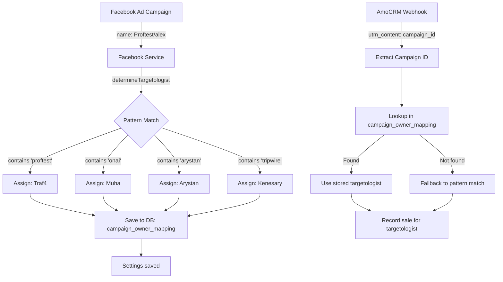

# 📊 UTM МЕТКИ: Как работает система

**Дата:** 22 декабря 2025  
**Статус:** ✅ ОБЪЯСНЕНИЕ ЛОГИКИ

---

## 🎯 ТЕКУЩИЕ ДАННЫЕ

### Теперь доступно 11 кабинетов из 2 BM:

**BM 1 (627807087089319):**
1. AI BOT Target - $906
2. onAI academy - $355,592
3. smmmcwin - $9,419
4. 3-1 - $65,834
5. YourTeam - $290,875
6. acc3 - $32,542

**BM 2 (109908023605532):**
7. Maqtakyz Vending - $34,833
8. **Nutrients.kz** - $1,465,486 ⭐
9. Tima - $554,339
10. Residence Astana - $324,696
11. RM Almaty - $1,843,962

**Итого:** 11 рекламных кабинетов ✅

---

## ❓ ВОПРОС: Как система понимает какого таргетолога кампания?

### Ответ: Система использует 2 источника

1. **Personal UTM Source** (из настроек)
2. **Pattern Matching** (автоматическое определение)

---

## 🔍 КАК ЭТО РАБОТАЕТ СЕЙЧАС

### 1. Personal UTM Source (Ручная настройка)

**Где настраивается:**
- Settings → "Персональная UTM метка"
- Каждый таргетолог вводит свою метку (например: `fb_muha`, `fb_arystan`)

**Пример:**
```typescript
// Muha настроил:
personal_utm_source: "fb_muha"

// Arystan настроил:
personal_utm_source: "fb_arystan"
```

**Проблема:** Это НЕ автоматически! Таргетолог должен вручную вписать метку в свои кампании.

---

### 2. Pattern Matching (Автоматическое определение)

**Где работает:**
- Backend (`/backend/src/integrations/`)
- Функция: `determineTargetologist()`

**Логика:**
```typescript
const TARGETOLOGIST_MAPPING: Record<string, string[]> = {
  'Kenesary': ['tripwire', 'nutcab', 'kenesary', 'kenji'],
  'Arystan': ['arystan'],
  'Muha': ['on ai', 'onai', 'запуск', 'yourmarketolog', 'muha'],
  'Traf4': ['alex', 'traf4', 'proftest', 'pb_agency'],
};

function determineTargetologist(utmCampaign: string | null, utmSource: string | null): string {
  const campaignLower = (utmCampaign || '').toLowerCase();
  const sourceLower = (utmSource || '').toLowerCase();

  for (const [targetologist, patterns] of Object.entries(TARGETOLOGIST_MAPPING)) {
    for (const pattern of patterns) {
      // Если utm_campaign или utm_source СОДЕРЖИТ паттерн
      if (campaignLower.includes(pattern.toLowerCase()) || 
          sourceLower.includes(pattern.toLowerCase())) {
        return targetologist;
      }
    }
  }

  return 'Unknown';
}
```

**Примеры работы:**

| UTM Campaign | UTM Source | Результат |
|--------------|------------|-----------|
| "OnAI Test Campaign" | "fb_muha" | **Muha** (содержит "onai") |
| "Proftest/alex" | null | **Traf4** (содержит "proftest") |
| "Tripwire Launch" | null | **Kenesary** (содержит "tripwire") |
| "My Campaign" | "fb_arystan" | **Arystan** (содержит "arystan") |
| "Random Campaign" | "facebook" | **Unknown** (нет совпадений) |

---

## 🚨 ПРОБЛЕМА: Не автоматическое определение по Campaign/Ad/AdSet NAME

**Сейчас система НЕ проверяет:**
- ❌ Название кампании в Facebook Ads Manager
- ❌ Название Ad Group (Ad Set)
- ❌ Название объявления (Ad Name)

**Система проверяет только:**
- ✅ `utm_campaign` (если таргетолог вручную добавил в URL)
- ✅ `utm_source` (если таргетолог вручную добавил в URL)

---

## 💡 РЕШЕНИЕ: Автоматическое определение по названию кампании

### Нужно изменить логику:

**ШАГ 1:** При загрузке кампаний из Facebook API проверять название

```typescript
// В facebook-service.ts
const campaigns = await fetchCampaignsForAccount(accountId);

// Для каждой кампании определяем таргетолога по НАЗВАНИЮ
campaigns.forEach(campaign => {
  const targetologist = determineTargetologist(campaign.name, null);
  campaign.targetologist = targetologist;
});
```

**ШАГ 2:** Сохранять связь "кампания → таргетолог" в БД

```sql
-- В таблице targetologist_settings добавить поле:
ALTER TABLE targetologist_settings 
ADD COLUMN campaign_owner_mapping JSONB;

-- Пример данных:
{
  "120238295917210535": "Traf4",  // Proftest/alex → Traf4
  "120237934038040535": "Traf4",  // alex/11.12 → Traf4
  "120237921216020535": "Muha"    // OnAI Test → Muha
}
```

**ШАГ 3:** При получении webhook из AmoCRM использовать эту связь

```typescript
// В unified-amocrm-webhook.ts
const campaignId = extractCampaignIdFromUTM(utmData);
const targetologist = getCampaignOwner(campaignId) || determineTargetologist(utmCampaign, utmSource);
```

---

## 🔧 ПРЕДЛАГАЕМАЯ АРХИТЕКТУРА



---

## ✅ ПРЕИМУЩЕСТВА НОВОГО ПОДХОДА

1. **Автоматическое определение** - не нужно вручную вписывать UTM
2. **По названию кампании** - система анализирует Campaign Name
3. **Сохраняется в БД** - один раз определил = всегда помнит
4. **Fallback на pattern match** - если не нашли в БД, используем старую логику

---

## 🎯 ПЛАН РЕАЛИЗАЦИИ

### Этап 1: Автоматическое определение при сохранении настроек

```typescript
// В TrafficSettings.tsx при сохранении:
const campaignOwnerMapping = {};

selectedCampaigns.forEach(campaign => {
  const targetologist = determineTargetologistByName(campaign.name);
  if (targetologist !== 'Unknown') {
    campaignOwnerMapping[campaign.id] = targetologist;
  }
});

// Сохранить в БД
await axios.put(`/api/traffic-settings/${userId}`, {
  ...settings,
  campaign_owner_mapping: campaignOwnerMapping
});
```

### Этап 2: Использование при webhook

```typescript
// В unified-amocrm-webhook.ts:
async function getTargetologistFromCampaign(campaignId: string): Promise<string | null> {
  // Ищем в БД у всех таргетологов
  const { data } = await trafficAdminSupabase
    .from('targetologist_settings')
    .select('user_id, campaign_owner_mapping')
    .not('campaign_owner_mapping', 'is', null);

  for (const row of data || []) {
    if (row.campaign_owner_mapping[campaignId]) {
      return row.campaign_owner_mapping[campaignId];
    }
  }

  return null;
}
```

---

## 📝 ТЕКУЩИЕ ПАТТЕРНЫ

```typescript
const TARGETOLOGIST_MAPPING = {
  'Kenesary': ['tripwire', 'nutcab', 'kenesary', 'kenji'],
  'Arystan': ['arystan'],
  'Muha': ['on ai', 'onai', 'запуск', 'yourmarketolog', 'muha'],
  'Traf4': ['alex', 'traf4', 'proftest', 'pb_agency'],
};
```

**Можно добавить больше паттернов:**
- Для Muha: добавить "yourteam", "yourtarget"
- Для Traf4: добавить "alexmarketing"
- Для Kenesary: добавить "nutri", "kenes"

---

## ❓ ВОПРОСЫ К ТЕБЕ

1. **Хочешь чтобы система автоматически определяла таргетолога по названию кампании?**
   - Да → Реализую Этап 1 + Этап 2
   - Нет → Оставляем как есть (ручная настройка UTM меток)

2. **Какие еще паттерны добавить в TARGETOLOGIST_MAPPING?**
   - Например: "yourteam" для Muha?
   - "nutrients" для какого таргетолога?

3. **Где должен быть campaign_id в UTM метках?**
   - `utm_content={campaign_id}`?
   - `utm_term={campaign_id}`?
   - Отдельный параметр?

---

## 🚀 ЧТО СДЕЛАТЬ ДАЛЬШЕ

**Если хочешь автоматическое определение:**

1. Я добавлю `campaign_owner_mapping` в БД схему
2. Обновлю TrafficSettings чтобы автоматически определять владельца при сохранении
3. Обновлю webhook логику чтобы использовать эту связь
4. Добавлю UI чтобы показывать какого таргетолога каждая кампания

**Если хочешь только улучшить паттерны:**

1. Добавлю новые паттерны в TARGETOLOGIST_MAPPING
2. Обновлю код на продакшн
3. Протестируем

---

**Скажи что хочешь и я реализую!** 💪
