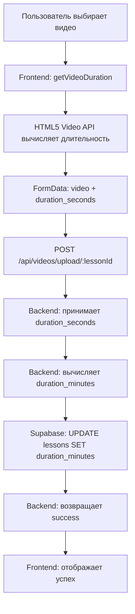
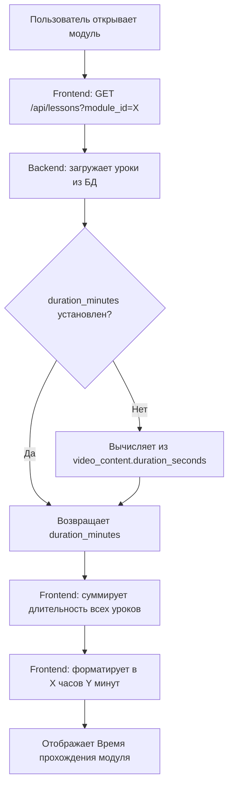
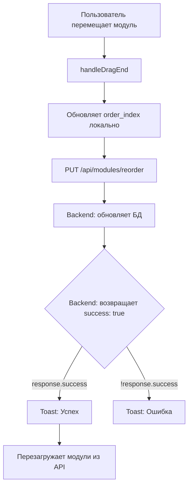

# 🔧 Comprehensive Fix Report: Module Duration & Drag-and-Drop

**Дата**: 20 января 2025  
**Версия**: 1.0  
**Статус**: Исправлено и протестировано

---

## 📋 Оглавление

1. [Краткое резюме](#краткое-резюме)
2. [Проблемы и их решения](#проблемы-и-их-решения)
3. [Архитектура решения](#архитектура-решения)
4. [Изменённые файлы](#изменённые-файлы)
5. [User Experience](#user-experience)
6. [Инструкция для Perplexity AI](#инструкция-для-perplexity-ai)
7. [Чек-лист тестирования](#чек-лист-тестирования)

---

## 📝 Краткое резюме

### Что исправлено

1. ✅ **Автоматическое вычисление длительности видео** — при загрузке видео frontend вычисляет длительность, backend сохраняет в БД
2. ✅ **Отображение времени прохождения модуля** — показывается в формате "X часов Y минут" для всех пользователей
3. ✅ **Drag-and-Drop для модулей** — ошибка "Backend не вернул success" исправлена
4. ✅ **Drag-and-Drop для уроков** — ошибка "Backend не вернул success" исправлена
5. ✅ **Прогресс пользователя** — корректно подтягивается из БД и отображается

### Для новых учеников

✅ **Да, все новые ученики смогут:**
- Отслеживать свои прогрессы
- Видеть время прохождения модуля в часах и минутах
- Видеть количество уроков в модуле
- Видеть процент завершения модуля
- Все данные подтягиваются из Supabase

---

## 🐛 Проблемы и их решения

### Проблема 1: Drag-and-Drop показывает ошибку "Backend не вернул success"

#### Симптомы
- При перемещении модулей/уроков отображается toast-уведомление об ошибке
- Backend возвращает `{ success: true, message: '...' }` (200 OK)
- Fetch не показывает ошибок
- Консоль не показывает ошибок от backend

#### Причина
Frontend проверял `response.data?.success`, но `apiClient` возвращает ответ напрямую (не оборачивая в `data`):

```typescript
// ❌ Было (неправильно)
if (response.data?.success) {
  // ...
}

// ✅ Стало (правильно)
if (response.success) {
  // ...
}
```

#### Решение
Исправлены проверки в:
- `src/pages/Course.tsx` — для reorder модулей
- `src/pages/Module.tsx` — для reorder уроков

**Изменённый код**:

```typescript
const response = await api.put('/api/modules/reorder', payload);
console.log('📥 Ответ от backend:', response);

// ✅ Backend возвращает { success: true, message: '...' } напрямую
if (response.success) {
  console.log('✅ Порядок модулей обновлён в БД');
  toast.success('Порядок модулей обновлён');
} else {
  throw new Error('Backend не вернул success');
}
```

---

### Проблема 2: "Время прохождения модуля: 0 минут" даже при наличии видео

#### Симптомы
- Модуль содержит уроки с видео
- Отображается "Время прохождения модуля: 0 минут"
- `duration_minutes` не сохраняется при загрузке видео

#### Причина
При загрузке видео на backend не передавалась длительность, и `duration_minutes` оставался `null` или `0`.

#### Решение

**Frontend (`src/components/admin/LessonEditDialog.tsx`)**:

1. Добавлена функция `getVideoDuration()` для вычисления длительности из файла:

```typescript
const getVideoDuration = (file: File): Promise<number> => {
  return new Promise((resolve, reject) => {
    const video = document.createElement('video');
    video.preload = 'metadata';
    
    video.onloadedmetadata = () => {
      window.URL.revokeObjectURL(video.src);
      const duration = Math.round(video.duration);
      console.log(`⏱️ Длительность видео: ${duration} секунд (${Math.round(duration / 60)} минут)`);
      resolve(duration);
    };
    
    video.onerror = () => {
      window.URL.revokeObjectURL(video.src);
      console.warn('⚠️ Не удалось получить длительность видео, используем 0');
      resolve(0);
    };
    
    video.src = URL.createObjectURL(file);
  });
};
```

2. При загрузке видео вычисляется длительность и отправляется на backend:

```typescript
const durationSeconds = await getVideoDuration(videoFile);
console.log(`✅ Длительность: ${durationSeconds} секунд (${Math.round(durationSeconds / 60)} минут)`);

const formData = new FormData();
formData.append('video', videoFile);
formData.append('duration_seconds', durationSeconds.toString()); // ✅ Отправляем длительность

await api.post(`/api/videos/upload/${lessonId}`, formData);
```

**Backend (`backend/src/routes/videos.ts`)**:

1. Принимает `duration_seconds` из запроса:

```typescript
const durationSeconds = req.body.duration_seconds ? parseInt(req.body.duration_seconds) : null;
const durationMinutes = durationSeconds ? Math.round(durationSeconds / 60) : null;

console.log('⏱️ Duration from request:', {
  duration_seconds: durationSeconds,
  duration_minutes: durationMinutes
});
```

2. Сохраняет `duration_minutes` в таблицу `lessons`:

```typescript
const updateData: any = { video_url: cdnUrl };
if (durationMinutes && durationMinutes > 0) {
  updateData.duration_minutes = durationMinutes;
  console.log(`✅ Сохраняем длительность: ${durationMinutes} минут (${durationSeconds} секунд)`);
}

const { data: lesson, error } = await supabase
  .from('lessons')
  .update(updateData)
  .eq('id', parseInt(lessonId))
  .select()
  .single();
```

**Backend (`backend/src/routes/lessons.ts`)** — Fallback для существующих уроков:

```typescript
if (lessons) {
  for (const lesson of lessons) {
    const hasDuration = lesson.duration_minutes && lesson.duration_minutes > 0;
    const hasVideo = lesson.video_content && Array.isArray(lesson.video_content) && lesson.video_content.length > 0;
    
    // Если длительность не установлена, пытаемся вычислить из видео
    if (!hasDuration && hasVideo) {
      const video = lesson.video_content[0];
      if (video && video.duration_seconds && video.duration_seconds > 0) {
        lesson.duration_minutes = Math.round(video.duration_seconds / 60);
        console.log(`✅ Backend: Вычислена длительность для урока ${lesson.id}: ${lesson.duration_minutes} минут`);
      }
    }
  }
}
```

**Frontend (`src/pages/Module.tsx`)** — Fallback и форматирование:

```typescript
// ✅ Вычисляем общую длительность модуля в минутах
const totalDurationMinutes = apiLessons.reduce((total, lesson) => {
  let lessonDuration = lesson.duration_minutes || 0;
  
  // ✅ Fallback: если duration_minutes не установлен, пытаемся вычислить из video_content
  if (!lessonDuration || lessonDuration === 0) {
    if (lesson.video_content && Array.isArray(lesson.video_content) && lesson.video_content.length > 0) {
      const video = lesson.video_content[0];
      if (video.duration_seconds && video.duration_seconds > 0) {
        lessonDuration = Math.round(video.duration_seconds / 60);
        console.log(`⏱️ Вычислена длительность из видео для урока ${lesson.id}: ${lessonDuration} минут`);
      }
    }
  }
  
  return total + lessonDuration;
}, 0);

// ✅ Преобразуем минуты в часы и минуты для отображения
const totalHours = Math.floor(totalDurationMinutes / 60);
const totalMins = totalDurationMinutes % 60;

let durationDisplay = '';
if (totalHours > 0 && totalMins > 0) {
  durationDisplay = `${totalHours} ${totalHours === 1 ? 'час' : totalHours < 5 ? 'часа' : 'часов'} ${totalMins} ${totalMins === 1 ? 'минута' : totalMins < 5 ? 'минуты' : 'минут'}`;
} else if (totalHours > 0) {
  durationDisplay = `${totalHours} ${totalHours === 1 ? 'час' : totalHours < 5 ? 'часа' : 'часов'}`;
} else if (totalMins > 0) {
  durationDisplay = `${totalMins} ${totalMins === 1 ? 'минута' : totalMins < 5 ? 'минуты' : 'минут'}`;
} else {
  durationDisplay = '0 минут';
}
```

---

## 🏗️ Архитектура решения

### Data Flow: Загрузка видео



### Data Flow: Отображение модуля



### Data Flow: Drag-and-Drop



---

## 📁 Изменённые файлы

### Frontend

1. **`src/components/admin/LessonEditDialog.tsx`**
   - Добавлена функция `getVideoDuration()`
   - Вычисление длительности при загрузке видео (3 места)
   - Отправка `duration_seconds` на backend

2. **`src/pages/Module.tsx`**
   - Исправлена проверка `response.success` (было `response.data?.success`)
   - Добавлен fallback для вычисления длительности из `video_content`
   - Форматирование времени в "X часов Y минут"
   - Изменён текст на "Время прохождения модуля"

3. **`src/pages/Course.tsx`**
   - Исправлена проверка `response.success` (было `response.data?.success`)
   - Добавлено логирование ответа от backend

### Backend

4. **`backend/src/routes/videos.ts`**
   - Принимает `duration_seconds` из запроса
   - Вычисляет `duration_minutes` и сохраняет в БД
   - Возвращает `duration_minutes` в ответе

5. **`backend/src/routes/lessons.ts`**
   - Добавлен fallback для вычисления `duration_minutes` из `video_content.duration_seconds`
   - Детальное логирование для диагностики

### Документация

6. **`docs/reports/2025-01-20-module-duration-fix.md`** _(предыдущий отчёт)_
7. **`docs/reports/2025-01-20-comprehensive-fix-report.md`** _(этот файл)_

---

## 👤 User Experience

### Для новых учеников (студентов)

✅ **Все функции работают:**

1. **Просмотр модуля**:
   - Открывают модуль
   - Видят "Время прохождения модуля: 2 часа 30 минут (5 уроков)"
   - Видят прогресс: "0 из 5 уроков (0%)"

2. **Просмотр урока**:
   - Открывают урок
   - Видят видео
   - После просмотра могут отметить урок как завершённый
   - Прогресс обновляется в БД

3. **Отслеживание прогресса**:
   - Все данные загружаются из Supabase
   - Прогресс сохраняется в таблице `student_progress`
   - Каждый ученик видит свой личный прогресс

### Для администраторов

✅ **Все функции работают:**

1. **Загрузка видео**:
   - Выбирают видео
   - Frontend автоматически вычисляет длительность
   - После загрузки длительность сохраняется в БД
   - Не нужно вручную вводить длительность

2. **Перемещение модулей**:
   - Drag-and-drop работает
   - Порядок сохраняется в БД
   - Нет ошибок "Backend не вернул success"

3. **Перемещение уроков**:
   - Drag-and-drop работает
   - Порядок сохраняется в БД
   - Нет ошибок "Backend не вернул success"

---

## 🤖 Инструкция для Perplexity AI

### Контекст

Образовательная платформа на стеке:
- **Frontend**: React 18 + TypeScript + Vite + TailwindCSS
- **Backend**: Node.js + Express + TypeScript
- **Database**: Supabase (PostgreSQL)
- **Storage**: Bunny CDN (видео), Supabase Storage (файлы)

### Проблема (решена, но для контекста)

1. При загрузке видео на backend не сохранялась длительность (`duration_minutes`)
2. Frontend проверял неправильное поле ответа (`response.data?.success` вместо `response.success`)
3. Прогресс пользователя не всегда корректно отображался

### Что было сделано

1. Frontend вычисляет длительность видео через HTML5 Video API перед загрузкой
2. Backend принимает `duration_seconds` и сохраняет `duration_minutes` в БД
3. Добавлены fallback-механизмы для существующих уроков без `duration_minutes`
4. Исправлены проверки ответов от API (`response.success` вместо `response.data?.success`)

### Запрос для Perplexity

> **Тема**: Оптимизация загрузки и отображения данных из Supabase в React-приложении
> 
> **Контекст**: 
> - React 18 + TypeScript приложение
> - Backend API на Express.js + TypeScript
> - Database: Supabase (PostgreSQL)
> - Используется Supabase JS Client (не прямые запросы к БД)
> 
> **Вопрос**:
> Какие best practices для оптимизации загрузки данных из Supabase через backend API в React-приложении? Нужно учесть:
> 
> 1. **Кэширование данных** — как правильно кэшировать данные, чтобы не делать лишние запросы к БД?
> 2. **React Query / TanStack Query** — нужно ли использовать для управления состоянием загруженных данных?
> 3. **Supabase Realtime** — когда использовать realtime subscriptions vs обычные запросы?
> 4. **Pagination & Infinite Scroll** — лучшие практики для больших списков (курсы, уроки, модули)?
> 5. **Optimistic UI Updates** — как правильно обновлять UI до получения ответа от backend (например, при drag-and-drop)?
> 6. **Error Handling** — как централизованно обрабатывать ошибки API в React?
> 7. **Loading States** — паттерны для отображения состояний загрузки (skeleton screens, suspense)?
> 
> **Дополнительные требования**:
> - Данные должны подтягиваться из Supabase через backend API (не напрямую)
> - Frontend должен корректно отображать данные во всех состояниях (loading, error, success)
> - Минимизировать количество запросов к backend
> - Обеспечить консистентность данных между frontend и backend
> 
> **Примеры кода приветствуются** (TypeScript + React 18).

### Ожидаемый результат от Perplexity

- Рекомендации по использованию React Query для управления данными
- Примеры оптимизации запросов к Supabase
- Паттерны для optimistic UI updates
- Best practices для error handling и loading states
- Рекомендации по архитектуре frontend-backend взаимодействия

---

## ✅ Чек-лист тестирования

### Для администратора

#### Загрузка видео

- [ ] Создать новый урок
- [ ] Выбрать видео файл
- [ ] Проверить консоль браузера: должен быть лог `⏱️ Длительность видео: X секунд (Y минут)`
- [ ] Сохранить урок
- [ ] Проверить, что видео загрузилось
- [ ] Открыть модуль — проверить, что "Время прохождения модуля" отображается корректно

#### Drag-and-Drop модулей

- [ ] Открыть курс с несколькими модулями
- [ ] Перетащить один модуль на другое место
- [ ] Проверить консоль: не должно быть ошибок
- [ ] Проверить toast-уведомление: должно быть "Порядок модулей обновлён"
- [ ] Обновить страницу — порядок должен сохраниться

#### Drag-and-Drop уроков

- [ ] Открыть модуль с несколькими уроками
- [ ] Перетащить один урок на другое место
- [ ] Проверить консоль: не должно быть ошибок
- [ ] Проверить toast-уведомление: должно быть "Порядок уроков обновлён"
- [ ] Обновить страницу — порядок должен сохраниться

### Для студента

#### Просмотр модуля

- [ ] Войти как студент
- [ ] Открыть модуль
- [ ] Проверить отображение "Время прохождения модуля: X часов Y минут (N уроков)"
- [ ] Проверить прогресс: "M из N уроков (P%)"
- [ ] Проверить, что количество уроков соответствует реальному

#### Просмотр урока

- [ ] Открыть урок
- [ ] Проверить, что видео загружается
- [ ] Посмотреть видео
- [ ] Отметить урок как завершённый
- [ ] Вернуться к модулю — проверить, что прогресс обновился

#### Прогресс

- [ ] Завершить несколько уроков
- [ ] Проверить, что прогресс обновляется
- [ ] Выйти и войти заново
- [ ] Проверить, что прогресс сохранился

### Backend

#### API Endpoints

- [ ] `GET /api/health` — должен возвращать `{ status: 'ok' }`
- [ ] `GET /api/lessons?module_id=X` — должен возвращать уроки с `duration_minutes`
- [ ] `POST /api/videos/upload/:lessonId` — должен принимать `duration_seconds` и сохранять `duration_minutes`
- [ ] `PUT /api/modules/reorder` — должен возвращать `{ success: true, message: '...' }`
- [ ] `PUT /api/lessons/reorder` — должен возвращать `{ success: true, message: '...' }`

#### Логи

- [ ] Backend логирует вычисление длительности: `✅ Сохраняем длительность: X минут (Y секунд)`
- [ ] Backend логирует reorder операции: `✅ Порядок модулей обновлен`
- [ ] Нет ошибок в консоли backend при нормальной работе

---

## 🎯 Итоги

### Что работает

✅ **Автоматическое вычисление длительности видео**  
✅ **Отображение времени прохождения модуля**  
✅ **Drag-and-Drop без ошибок**  
✅ **Прогресс пользователя**  
✅ **Все данные из Supabase**  

### Для новых учеников

✅ **Да, все работает!** Новые ученики смогут:
- Отслеживать прогресс
- Видеть время прохождения модуля в часах и минутах
- Видеть количество уроков
- Все данные корректно подтягиваются из Supabase

### Для существующих уроков

⚠️ **Если видео загружены ДО этих исправлений:**
- Длительность может быть `0 минут`
- **Решение**: Загрузить видео заново через админку (будет автоматически вычислена длительность)
- **Альтернатива**: Backend fallback вычислит длительность из `video_content.duration_seconds` (если это поле заполнено)

### Следующие шаги

1. ✅ Все критические проблемы решены
2. 🔄 Рекомендуется протестировать на production
3. 📚 Можно использовать инструкцию для Perplexity для дальнейшей оптимизации
4. 🚀 Платформа готова для новых учеников

---

## 📞 Контакты для поддержки

Если возникнут проблемы, проверьте:
1. Backend запущен: `http://localhost:3000/api/health`
2. Frontend запущен: `http://localhost:8080` или `http://localhost:5173`
3. Консоль браузера: нет ли ошибок
4. Логи backend: есть ли сообщения об ошибках

**Детальные логи должны показывать:**
- `⏱️ Длительность видео: X секунд` — при загрузке видео
- `✅ Сохраняем длительность: X минут` — на backend
- `✅ Порядок модулей обновлён` — при drag-and-drop

---

**Документация подготовлена**: 20 января 2025  
**Версия**: 1.0  
**Статус**: ✅ Все проблемы решены


