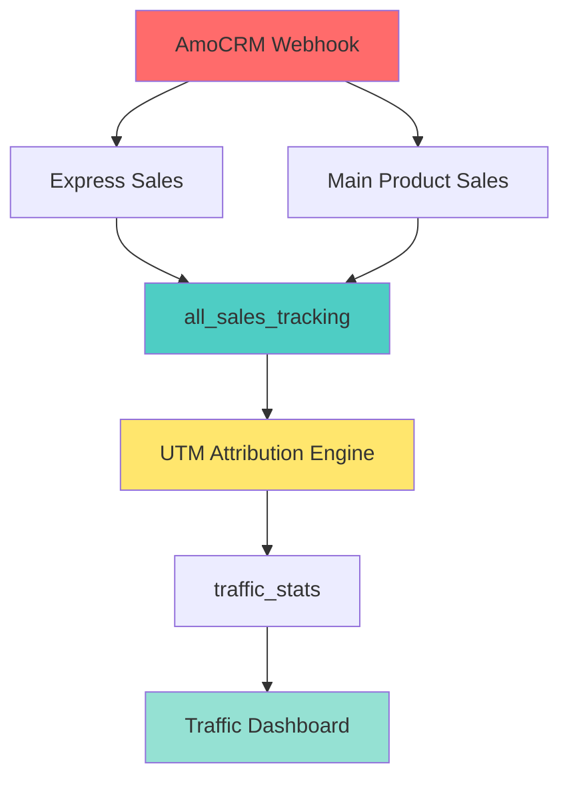
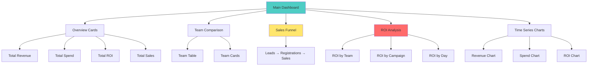
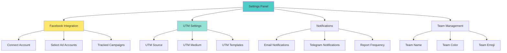
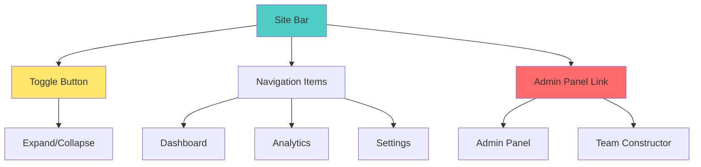

```mermaid
graph LR
    A[Traffic Targetologist] --> B[Settings Panel]
    B --> C[Connect Facebook Account]
    C --> D[OAuth Flow]
    D --> E[Store Access Token]
    E --> F[Fetch Ad Accounts]
    F --> G[Select Accounts to Track]
    G --> H[Sync Campaign Stats]
    H --> I[traffic_stats]
    
    style B fill:#4ecdc4
    style D fill:#ffe66d
    style I fill:#95e1d3
```

# Traffic Dashboard - Детальный план архитектурных решений

## 📋 Обзор проблемы

Хотя технический деплой прошел успешно, система **НЕ готова к продакшену** из-за множественных архитектурных и функциональных проблем.

### Критические проблемы:

1. ❌ **AuthManager ReferenceError** - `AuthManager` не импортирован в `TrafficTeamConstructor.tsx`
2. ❌ **4 команды в БД** - устаревшие данные (Arystan, Kenesary, Muha, Traf4) нужно очистить
3. ❌ **Отсутствующие таблицы** - `sales_activity_log`, `lead_tracking` не найдены
4. ❌ **403 Forbidden** - JWT token malformed при создании команд
5. ❌ **Attribution пустой** - нет данных из AmoCRM
6. ❌ **Нет главного дашборда** - отсутствует агрегированная аналитика по всем командам
7. ❌ **Раздел настроек не реализован** - нет подключения Facebook Ads
8. ❌ **Нет сворачиваемого site bar** - нет Admin Panel в меню

---

## 🎯 Архитектурные требования

### 1. UTM-атрибуция и интеграция с AmoCRM

#### Текущее состояние:
- ✅ Таблицы `express_course_sales` (166 записей) и `main_product_sales` (12 записей) существуют
- ✅ Таблица `all_sales_tracking` существует (0 записей)
- ✅ Таблица `traffic_stats` существует (17 записей)
- ❌ Таблицы `sales_activity_log`, `lead_tracking` отсутствуют
- ❌ Нет логики синхронизации данных из AmoCRM

#### Требуемая архитектура:



**Компоненты:**

1. **Webhook Handler** (уже существует в backend):
   - Принимает webhooks от AmoCRM
   - Сохраняет в `express_course_sales` и `main_product_sales`

2. **Sales Aggregator** (НОВЫЙ):
   - Агрегирует данные из `express_course_sales` и `main_product_sales`
   - Заполняет `all_sales_tracking`
   - Добавляет UTM-метки из `landing_leads`

3. **UTM Attribution Engine** (НОВЫЙ):
   - Сопоставляет `utm_source` с командами
   - Формат: `fb_teamname` → команда `teamname`
   - Обновляет поле `team` в `traffic_stats`

4. **Traffic Stats Calculator** (НОВЫЙ):
   - Агрегирует данные по дням/командам
   - Рассчитывает ROI, CPA, ROAS
   - Обновляет `traffic_stats`

**Требуемые таблицы:**

```sql
-- sales_activity_log - Лог активности продаж
CREATE TABLE sales_activity_log (
  id UUID PRIMARY KEY DEFAULT gen_random_uuid(),
  sale_id UUID REFERENCES all_sales_tracking(id),
  action_type TEXT NOT NULL, -- 'created', 'updated', 'attributed'
  team_name TEXT,
  user_id UUID REFERENCES traffic_users(id),
  metadata JSONB DEFAULT '{}',
  created_at TIMESTAMPTZ DEFAULT NOW()
);

-- lead_tracking - Трекинг лидов по UTM
CREATE TABLE lead_tracking (
  id UUID PRIMARY KEY DEFAULT gen_random_uuid(),
  lead_id UUID REFERENCES landing_leads(id),
  utm_source TEXT,
  utm_medium TEXT,
  utm_campaign TEXT,
  utm_content TEXT,
  utm_term TEXT,
  team_name TEXT,
  attributed_at TIMESTAMPTZ,
  created_at TIMESTAMPTZ DEFAULT NOW(),
  updated_at TIMESTAMPTZ DEFAULT NOW()
);
```

### 2. Facebook Ads Integration

#### Требуемая архитектура:



**Компоненты:**

1. **Facebook OAuth Handler** (НОВЫЙ):
   - OAuth flow для подключения аккаунта
   - Хранение access token в `traffic_targetologist_settings.fb_access_token`
   - Автоматическое обновление токена

2. **Ad Account Fetcher** (НОВЫЙ):
   - Получение списка рекламных аккаунтов через Facebook Marketing API
   - Хранение в `traffic_targetologist_settings.fb_ad_accounts`

3. **Campaign Stats Sync** (НОВЫЙ):
   - Ежедневная синхронизация статистики кампаний
   - Запись в `traffic_stats`
   - Атрибутация по UTM source

**API Endpoints:**

```typescript
// Facebook OAuth
POST /api/traffic-admin/facebook/oauth-url
GET /api/traffic-admin/facebook/callback
POST /api/traffic-admin/facebook/disconnect

// Ad Accounts
GET /api/traffic-admin/facebook/ad-accounts
POST /api/traffic-admin/facebook/ad-accounts/select

// Campaign Stats
POST /api/traffic-admin/facebook/sync-stats
GET /api/traffic-admin/facebook/campaign-stats
```

### 3. Главный Dashboard с аналитикой

#### Требуемый UI:



**Метрики:**

1. **Overview Cards:**
   - Total Revenue (KZT/USD)
   - Total Spend (KZT/USD)
   - Total ROI (%)
   - Total Sales (Express + Flagman)

2. **Team Comparison:**
   - Таблица с метриками по каждой команде
   - Карточки с визуализацией
   - Сортировка по любому столбцу

3. **Sales Funnel:**
   - Leads (из `landing_leads`)
   - Registrations (из `traffic_stats.registrations`)
   - Express Sales (из `traffic_stats.express_sales`)
   - Flagman Sales (из `traffic_stats.main_sales`)
   - Конверсии на каждом этапе

4. **ROI Analysis:**
   - ROI по командам
   - ROI по кампаниям
   - ROI по дням
   - Heatmap

5. **Time Series:**
   - Revenue over time
   - Spend over time
   - ROI over time
   - Интервалы: день, неделя, месяц

### 4. Раздел настроек (Settings Panel)

#### Требуемый UI:



**Компоненты:**

1. **Facebook Integration:**
   - Кнопка "Connect Facebook Account"
   - Список подключенных ad accounts
   - Выбор кампаний для отслеживания
   - Статус подключения

2. **UTM Settings:**
   - Настройка `utm_source` (по умолчанию: `facebook`)
   - Настройка `utm_medium` (по умолчанию: `cpc`)
   - UTM шаблоны для генерации

3. **Notifications:**
   - Email для уведомлений
   - Telegram chat ID
   - Частота отчетов (daily, weekly, monthly)

4. **Team Management:**
   - Название команды
   - Цвет команды
   - Emoji команды

### 5. Сворачиваемый Site Bar

#### Требуемая архитектура:



**Компоненты:**

1. **Toggle Button:**
   - Иконка (hamburger menu)
   - Анимация сворачивания/разворачивания
   - Сохранение состояния в localStorage

2. **Navigation Items:**
   - Dashboard
   - Analytics
   - Settings
   - Logout

3. **Admin Panel Link:**
   - Только для admin role
   - Admin Panel
   - Team Constructor

### 6. Безопасность

#### Требуемые проверки:

1. **Authentication:**
   - ✅ JWT токены хранятся в sessionStorage/localStorage
   - ✅ `AuthManager` управляет токенами
   - ❌ Нужно добавить refresh token rotation

2. **Authorization:**
   - ✅ `TrafficGuard` проверяет аутентификацию
   - ✅ `requireAdmin` для admin routes
   - ❌ Нужно добавить RBAC (Role-Based Access Control)

3. **API Security:**
   - ✅ `authenticateToken` middleware на всех routes
   - ❌ Нужно добавить rate limiting
   - ❌ Нужно добавить CORS headers
   - ❌ Нужно добавить input validation

4. **Data Security:**
   - ✅ RLS (Row Level Security) на Supabase
   - ❌ Нужно добавить encryption для sensitive data
   - ❌ Нужно добавить audit logging

---

## 📝 План реализации

### Phase 1: Критические исправления (СРОЧНО)

1. **Fix AuthManager Import**
   - Добавить импорт `AuthManager` в `TrafficTeamConstructor.tsx`
   - Протестировать создание команд

2. **Очистка существующих команд**
   - Создать SQL скрипт для удаления 4 команд
   - Сохранить UTM-метки (если нужно)
   - Выполнить на production

3. **Создать отсутствующие таблицы**
   - `sales_activity_log`
   - `lead_tracking`
   - Применить миграцию на production

4. **Fix JWT Token Issue**
   - Исследовать почему токен malformed
   - Исправить формат токена
   - Протестировать

### Phase 2: UTM-атрибуция и AmoCRM

5. **Sales Aggregator**
   - Создать backend endpoint для агрегации
   - Заполнить `all_sales_tracking`
   - Тестировать

6. **UTM Attribution Engine**
   - Создать логику сопоставления UTM → Team
   - Обновить `traffic_stats`
   - Тестировать

7. **Traffic Stats Calculator**
   - Создать endpoint для расчета метрик
   - Обновить `traffic_stats`
   - Тестировать

### Phase 3: Facebook Ads Integration

8. **Facebook OAuth Handler**
   - Реализовать OAuth flow
   - Хранить токены
   - Тестировать

9. **Ad Account Fetcher**
   - Получать ad accounts
   - Отображать в UI
   - Тестировать

10. **Campaign Stats Sync**
    - Синхронизировать статистику
    - Записывать в `traffic_stats`
    - Тестировать

### Phase 4: UI Components

11. **Main Dashboard**
    - Создать компонент
    - Добавить метрики
    - Добавить графики
    - Тестировать

12. **Settings Panel**
    - Создать компонент
    - Добавить Facebook integration
    - Добавить UTM settings
    - Тестировать

13. **Collapsible Site Bar**
    - Создать компонент
    - Добавить toggle
    - Добавить Admin Panel link
    - Тестировать

### Phase 5: Безопасность

14. **Refresh Token Rotation**
    - Реализовать логику
    - Тестировать

15. **RBAC**
    - Определить роли
    - Реализовать middleware
    - Тестировать

16. **Rate Limiting**
    - Настроить rate limiter
    - Тестировать

17. **CORS Headers**
    - Настроить CORS
    - Тестировать

18. **Input Validation**
    - Добавить validation
    - Тестировать

19. **Audit Logging**
    - Создать audit log
    - Логировать действия
    - Тестировать

---

## 🎨 Дизайн-системы

### Цветовая палитра:
- Primary: `#00FF88` (Неоновый зеленый)
- Secondary: `#3B82F6` (Синий)
- Accent: `#F59E0B` (Оранжевый)
- Danger: `#EF4444` (Красный)
- Success: `#10B981` (Изумрудный)
- Background: `#000000` (Черный)
- Surface: `rgba(0,0,0,0.4)` (Полупрозрачный черный)

### Шрифты:
- Headings: Inter, 700
- Body: Inter, 400
- Mono: JetBrains Mono

### Компоненты:
- Cards: `bg-black/40 border border-[#00FF88]/10 rounded-2xl`
- Buttons: `bg-[#00FF88] hover:bg-[#00FF88]/90 text-black`
- Inputs: `bg-black/50 border-[#00FF88]/20 text-white`

---

## 📊 Метрики успеха

### Технические метрики:
- ✅ Все API endpoints работают без ошибок
- ✅ JWT аутентификация работает корректно
- ✅ UTM-атрибуция работает автоматически
- ✅ Facebook Ads интеграция работает
- ✅ Все таблицы в БД созданы

### Бизнес-метрики:
- ✅ Admin может видеть аналитику по всем командам
- ✅ Targetologists могут видеть свою аналитику
- ✅ ROI рассчитывается корректно
- ✅ Sales funnel отображается корректно
- ✅ Уведомления работают

---

## ❓ Вопросы к пользователю

1. **UTM-метки существующих команд** - нужно ли сохранить UTM-метки команд Arystan, Kenesary, Muha, Traf4 перед удалением?

2. **Facebook Ads** - есть ли уже подготовленные Facebook App ID и Secret для OAuth?

3. **AmoCRM** - какие именно поля из AmoCRM нужно синхронизировать в Traffic Dashboard?

4. **Отчеты** - какая частота отчетов нужна? (daily, weekly, monthly)

5. **Уведомления** - через какие каналы отправлять уведомления? (Email, Telegram, оба)

6. **ROI Calculation** - какая формула ROI используется? `(Revenue - Spend) / Spend * 100`?

7. **Currency** - в какой валюте отображать метрики? (KZT, USD, обе)

8. **Timezone** - в какой таймзоне отображать данные? (Asia/Almaty, UTC)

---

## 📋 Checklist для согласования

- [ ] Уточнить ответы на вопросы выше
- [ ] Согласовать архитектуру UTM-атрибуции
- [ ] Согласовать архитектуру Facebook Ads integration
- [ ] Согласовать UI для Main Dashboard
- [ ] Согласовать UI для Settings Panel
- [ ] Согласовать UI для Collapsible Site Bar
- [ ] Согласовать план миграции БД
- [ ] Согласовать план очистки существующих команд
- [ ] Согласовать план создания тестовых пользователей
- [ ] Согласовать приоритеты фаз реализации
